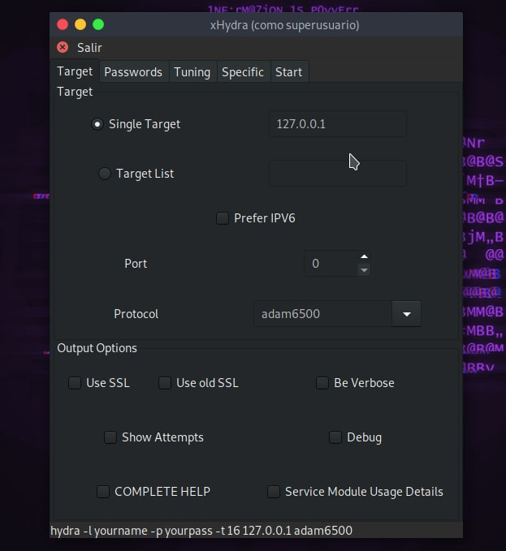

# XHydra-GUI

# Como usar 

$ sudo apt-get install hydra-gtk

$ git clone https://github.com/RIP-Network/XHydra-GUI

$ cd XHydra-GUI

$ bash configure

$ make

$ make install

$ bash xhydra.sh

# Información 

-l LOGIN donde “LOGIN” será el usuario con el que entraremos

-p PASS donde “PASS” será su contraseña con la que entraremos

-C ARCHIVO Habilita el formato “user”:”password” en vez de -l/-p

-M ARCHIVO Archivo con lista de los servidores a los que atacar

-t TAREA Establece el número de “tareas” que se conectarán al servidor objetivo

-U Detalla los módulos que utilizará de forma complementaria

-h  ofrece ayuda al usuario mostrando los comandos compatibles

# Ejemplo

hydra -l user -P passlist.txt ftp://127.0.0.1

# Sistemas testeados

* Parrot OS
* Kali Linux
* Ubuntu

# Fotos

#

      
    

